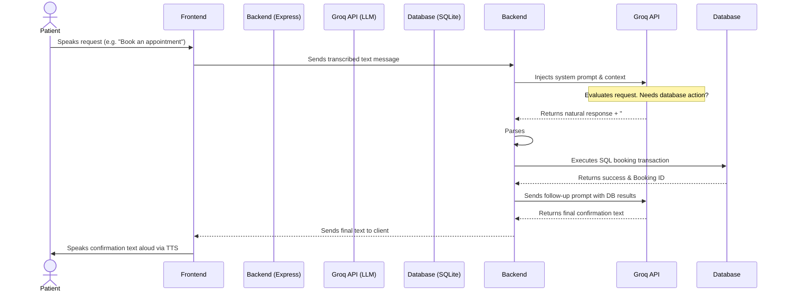

# SmileCare - AI-Powered Dental Clinic Management System

Welcome to **SmileCare**, a modern, full-stack Dental Clinic Management platform equipped with an intelligent AI Voice Assistant. SmileCare digitizes the entire clinic workflow, providing dedicated portals for Patients, Dentists, and Administrators. 

## 🚀 Key Features & User Roles

### 1. Patient Portal
The Patient Portal is designed for ease of use, allowing patients to manage their dental health efficiently.
- **Dashboard**: View a high-level summary of upcoming dental visits.
- **My Appointments**: Track all upcoming and past appointments. View statuses (Pending, Confirmed, Completed, Cancelled).
- **Our Dentists**: Browse the clinic's dental professionals, their specializations, and bios.
- **Services**: View available dental treatments, durations, and pricing.
- **AI Voice Assistant**: A fully conversational, intelligent receptionist.

### 2. Dentist Portal
The Dentist Portal empowers dental professionals to manage their daily schedule and patients.
- **Dashboard**: View daily statistics (Today's appointments, Pending, Confirmed, Completed) and a snapshot of today's schedule.
- **Appointments Management**: Review incoming appointment requests. Dentists can **Confirm** or **Cancel** pending appointments and mark them as **Completed**.
- **My Schedule**: Manage working hours and daily availability.

### 3. Administrator Portal
The Admin Portal provides complete oversight of the clinic's operations and financial health.
- **Dashboard**: Visualize clinic analytics, total revenue, appointment trends (via interactive charts), and active dentists.
- **Appointments Oversight**: Monitor every appointment in the system.
- **Dentist & Patient Management**: Manage user accounts and view patient histories.
- **Services & Holidays**: Configure the clinic's available treatments, pricing, and block out clinic holidays.

### 4. 🤖 AI Voice Assistant (Intelligent Receptionist)
SmileCare features a state-of-the-art AI Voice Assistant that acts as a 24/7 intelligent receptionist for patients.
- **Conversational Voice Interface**: Patients can speak directly to the AI to ask questions or manage bookings.
- **Automated Booking**: The AI can seamlessly book new appointments, automatically capturing the dentist, service, date, and time, and returning a Booking ID.
- **Availability Checking**: The AI interfaces directly with the database to check if a specific dentist is available on a requested date.
- **Rescheduling & Cancellations**: Patients can ask the AI to cancel or reschedule existing appointments without navigating any menus.
- **Context-Aware**: The AI remembers previous context in the conversation and strictly adheres to the clinic's rules (e.g., explaining that new appointments are marked "Pending" until confirmed by staff).

### ⚙️ AI Pipeline Architecture

The Voice Assistant relies on a custom hybrid pipeline to securely interface a Large Language Model with our internal SQLite database without risking hallucinated JSON or vulnerable tool calling:

#### Pipeline Workflow:
1. **Input Transcription**: The user's speech is captured and transcribed to text in the browser.
2. **Initial LLM Call**: The text is sent to the backend, which appends a strict system prompt and forwards it to the Groq API (`qwen3.8-27b`). 
3. **Action Trigger (###LOOKUP)**: To prevent strict-JSON parser crashes, the AI is instructed to output specific pipe-separated (`|`) strings (e.g., `###LOOKUP: check_availability | 5 | 2026-11-10`) if it needs to trigger backend actions.
4. **Local Execution**: The Express backend intercepts this string, strips it from the user's view, and executes the corresponding local SQLite database queries.
5. **Contextual Follow-up**: If a database action was executed, the backend silently feeds the results back to the AI in a secondary prompt so the AI can naturally narrate the result to the user.
6. **Voice Synthesis**: The final plain-text response is sent to the frontend, where the Web Speech API reads it aloud to the patient.

---

## 🔐 Test Credentials

You can log into the system using the following seeded credentials.

### Administrator
| Name | Email | Password | Role |
| :--- | :--- | :--- | :--- |
| Admin User | `admin@smilecare.com` | `admin123` | Full System Access |

### Dentists (Password for all: `dentist123`)
| Name | Email | Specialization |
| :--- | :--- | :--- |
| Dr. Priya Sharma | `priya@smilecare.com` | Orthodontics |
| Dr. Rajesh Kumar | `rajesh@smilecare.com` | Endodontics |
| Dr. Anita Patel | `anita@smilecare.com` | Pediatric Dentistry |
| Dr. Vikram Singh | `vikram@smilecare.com` | Oral Surgery |
| Dr. Meera Reddy | `meera@smilecare.com` | Cosmetic Dentistry |

### Patients (Password for all: `patient123`)
| Name | Email |
| :--- | :--- |
| Rahul Verma | `rahul@email.com` |
| Sneha Gupta | `sneha@email.com` |
| Amit Joshi | `amit@email.com` |

---

## 🛠️ Technology Stack
- **Frontend**: React (Vite), React Router, Recharts, Lucide Icons, CSS Modules
- **Backend**: Node.js, Express.js
- **Database**: SQLite (better-sqlite3)
- **AI Integration**: Groq API (`qwen/qwen3.8-27b`)
- **Authentication**: JWT & bcryptjs

## 📦 Running the Application
1. Start the backend server: `cd server && npm run dev`
2. Start the frontend server: `npm run dev`
3. Access the application at `http://localhost:5173`
